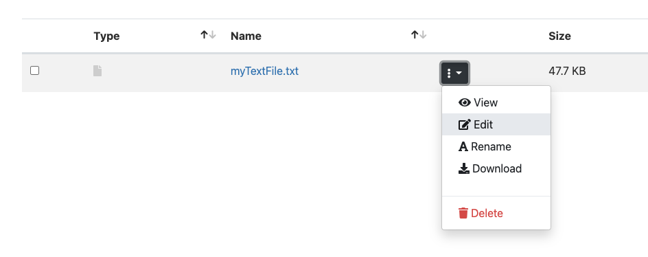
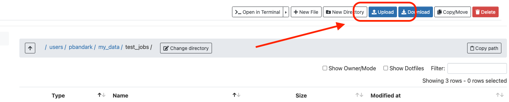

# Using File Explorer on OOD

The filesystem on Oscar can be accessed through the file explorer on this web portal. The file explorer allows you

* List files
* Create a directory
* Rename files
* [Edit plain-text files](using-file-explorer-on-ood.md#edit-plain-text-files)
* [Upload files or directories](using-file-explorer-on-ood.md#upload-files-or-directories)
* [Download files or directories](using-file-explorer-on-ood.md#download-files-or-directories)
* Copy/Move files
* [Launch a terminal from the current directory](using-file-explorer-on-ood.md#undefined)

To access the file explorer, click "Files" -> "Home Directory" at the top of the screen.

.png>)

Check the documentation below for some of these services below:

### Changing directories on File explorer

To access a directory, click "Change directory" and enter the path name


Do not use "\~" in your directory path name. The path should start with "/users" or "/gpfs/"


* To access your home directory, click the "**Home Directory**" link on the left. The path name at the top of the page should change to "/users/\<username>"
* To access your scratch directory, click the "scratch" directory in your home directory **OR** click "Change directory" and enter "/users/\<username>/scratch"
* To access your data directory, click the "data" directory in your home directory **OR** click  "Change directory" and enter "/users/\<username>/data"

### Edit plain-text files

1. [Navigate to the directory](using-file-explorer-on-ood.md#changing-directories-on-file-explorer) that contains the plain-text file.
2. Click the icon with the three dots -> Edit
3. The file will open in a text editor in a new tab

### Download files or directories

1. [Navigate to the directory](using-file-explorer-on-ood.md#changing-directories-on-file-explorer) that contains the file or directory.
2. Click the icon with the three dots -> Download

.png>)

To download multiples files:

1. Click the check-box to the left of the file name.
2. Scroll to the top of the page and click "Download"

Directories are downloaded as zipped files on your computer.

### Upload files or directories

1. [Navigate to the directory](using-file-explorer-on-ood.md#changing-directories-on-file-explorer) where you need to upload the files.
2. Click the "Upload" button.
3. Follow the instructions on the screen. You can click the "Browse" buttons or drag and drop files.

### Launch a terminal

1. [Navigate to the directory](using-file-explorer-on-ood.md#changing-directories-on-file-explorer)  where you would like to open the terminal
2. Click "Open in Terminal" at the top of the page.
3. A web-based terminal will open in a new tab of your browser.  You will be logged into one of the login nodes.

