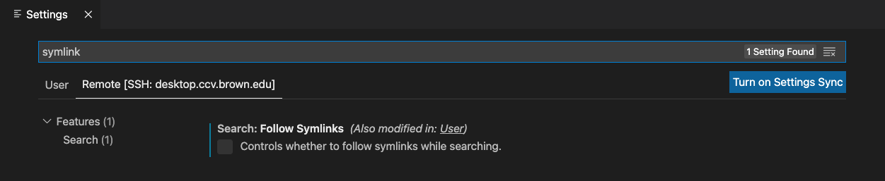
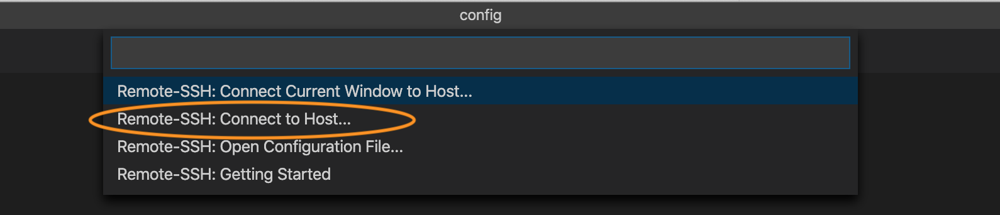
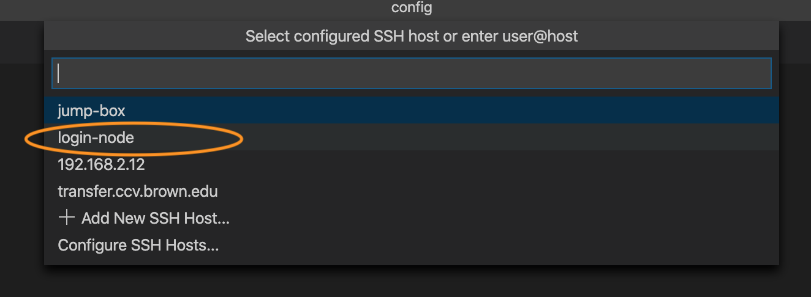

# Remote IDE

## VSCode

1. Install the [Remote Development extension pack](https://aka.ms/vscode-remote/download/extension) for VSCode
2. Open VSCode settings 

* On Windows/Linux - **File** &gt; **Preferences** &gt; **Settings**
* On macOS - **Code** &gt; **Preferences** &gt; **Settings**

Search for `symlink` and make sure the symlink searching is unchecked



3. Make sure you have a working key-pair setup for passwordless authentication. If you don't have one setup please refer to this [documentation page](https://docs.ccv.brown.edu/oscar/connecting-to-oscar/ssh/ssh-key-login-passwordless-ssh):

```text
ssh-copy-id <username>@ssh.ccv.brown.edu
```

The public key will be automatically appended to the `authorized_keys` file on Oscar. 

4. Edit the `~/.ssh/config` file on your local machine, add the following lines. Replace `<username>` with your Oscar username. 

```text
# Jump box with public IP address
Host jump-box
    HostName desktop.ccv.brown.edu
    User <username>

# Target machine with private IP address
Host login-node
    HostName oscar2
    User <username>
    ProxyCommand ssh -q -W %h:%p jump-box
```

5.  In VSCode, select  **Remote-SSH: Connect to Host…** and after the list populates select `login-node`





6. After a moment, VS Code will connect to the SSH server and set itself up.


