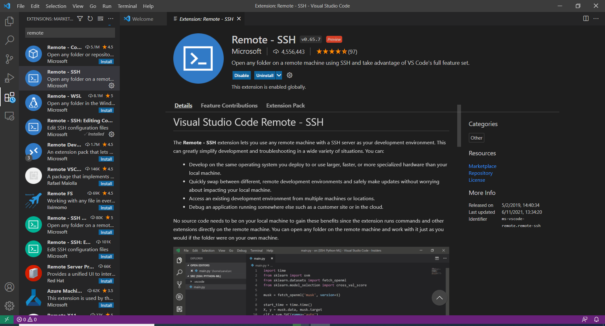

# Remote IDE (VSCode)

## VSCode one-time setup


To use VSCode you must be on a Brown compliant network or connected to the VPN. Please install the [Brown VPN client](https://vpn.brown.edu/) before proceeding.&#x20;



**September 10, 2023:** Some users have reported issues while connecting to the Oscar VSCode remote extension. This is due to a recent change introduced by VSCode. To address this issue

Ctrl (cmd on Mac) + Shift + P > Remote-SSH: Settings

Disable the Remote.SSH: Use Exec Server option




To use VSCode you will need to be connected to the VPN. Please install the [Brown VPN client](https://vpn.brown.edu) before proceeding.

1. Install the [Remote Development extension pack](https://aka.ms/vscode-remote/download/extension) for VSCode:

<figure><figcaption></figcaption></figure>

2\. Open VSCode settings and uncheck symlink:



**Code** > **Preferences** > **Settings**



**File** > **Preferences** > **Settings**



Search for `symlink` and make sure the symlink searching is unchecked


3\. Make sure you have set up passwordless SSH authentication to Oscar. If you haven't, please refer to this [documentation page](https://docs.ccv.brown.edu/oscar/connecting-to-oscar/ssh/ssh-key-login-passwordless-ssh).


If you have **Windows Subsystem for Linux (WSL)** installed in your computer, you need to follow the instructions for Windows (PowerShell).


4\. Edit the `config` file:



The `config` file is located at:

`~/.ssh/config`



The `config` file is located at:

```
C:\Users\<uname>\.ssh\config
```




If you have **Windows Subsystem for Linux (WSL)** installed in your computer, you need to follow the instructions for Windows (PowerShell).&#x20;


Edit the `config` file on your local machine, add the following lines. Replace `<username>` with your Oscar username.&#x20;

```
# Jump box with public IP address
Host jump-box
    HostName poodcit4.services.brown.edu
    User <username>

# Target machine with private IP address
Host ccv-vscode-node
    HostName vscode1
    User <username>
    ProxyCommand ssh -q -W %h:%p jump-box
```

5. _**September 10, 2023:**_ Some users have reported issues while connecting to the Oscar VSCode remote extension. This is due to a recent change introduced by VSCode. To address this issue

```
Ctrl (cmd on Mac) + Shift + P > Remote-SSH: Settings
Disable the Remote.SSH: Use Exec Server option
```

6. In VSCode, select  **Remote-SSH: Connect to Host…** and after the list populates select `ccv-vscode-node`


<figure><figcaption></figcaption></figure>

6\. Install and set up of VSCode



After a moment, VS Code will connect to the SSH server and set itself up.



After a moment, VS Code will connect to the SSH server and set itself up. You might see the Firewall prompt, please click allow.&#x20;





7. Configure VSCode


Important: Please run the following to add a settings.json file to your config. This is because the filewatcher and file searcher (rg) indexes all the files you have access to in your workspace. If you have a large dataset (e.g. machine learning) this can take a lot of resources on the vscode node.


Connect to VSCode first.

You can either create a symlink via the `ln` command below,

```
ln -s /gpfs/runtime/opt/vscode-server/ccv-vscode-config/settings.json /users/$USER/.vscode-server/data/Machine/settings.json
```

or manually create `/users/$USER/.vscode-server/data/Machine/settings.json` file with following contents

```
{
    "files.watcherExclude": {
        "**/.git/objects/**": true,
        "**/.git/subtree-cache/**": true,
        "**/node_modules/**": true,
        "/usr/local/**": true,
        "/gpfs/home/**": true,
        "/gpfs/data/**": true,
        "/gpfs/scratch/**": true
    },
    "search.followSymlinks": false,
    "search.exclude": {
        "**/.git/objects/**": true,
        "**/.git/subtree-cache/**": true,
        "**/node_modules/**": true,
        "/usr/local/**": true,
        "/gpfs/home/**": true,
        "/gpfs/data/**": true,
        "/gpfs/scratch/**": true
    }
}
```

## Reconnect to VSCode

1. Click the green icon "Open a Remote Window" in the bottom left corner of VSCode Window. Then click "Connect to Host" in the drop down list.

<figure><figcaption></figcaption></figure>

2\. Select the `ccv-vscode-node` option to connect to Oscar.&#x20;

<figure><figcaption></figcaption></figure>
