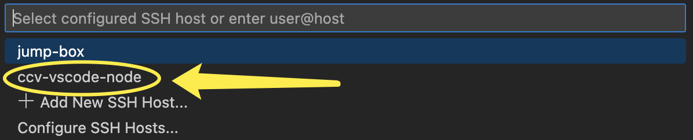

# From Non-compliant Networks (2-FA)


This guide is only for users connecting from Non-Brown Compliant Networks. 2-FA is mandatory.


1. Install the [Remote Development extension pack](https://aka.ms/vscode-remote/download/extension) for VSCode
2. Open VSCode settings&#x20;

* On Windows/Linux - **File** > **Preferences** > **Settings**
* On macOS - **Code** > **Preferences** > **Settings**

Search for `symlink` and make sure the symlink searching is unchecked


3\. Under VSCode settings, search for <mark style="color:blue;">remote ssh timeout</mark> and manually enter a timeout value i.e. <mark style="color:blue;">50s</mark>. It should give you enough time to complete 2-Factor Authentication.


4\. Edit the `~/.ssh/config` file on your local machine, add the following lines. Replace `<username>` with your Oscar username.

```
# Jump box with public IP address
Host jump-box
  HostName ssh8.ccv.brown.edu
  User <username>
# Target machine with private IP address
Host ccv-vscode-node
  HostName node1103
  User <username>
  ProxyCommand ssh -q -W %h:%p jump-box
```

6\. In VSCode, select  **Remote-SSH: Connect to Host…** and after the list populates select `login-node`


<figure><figcaption></figcaption></figure>

