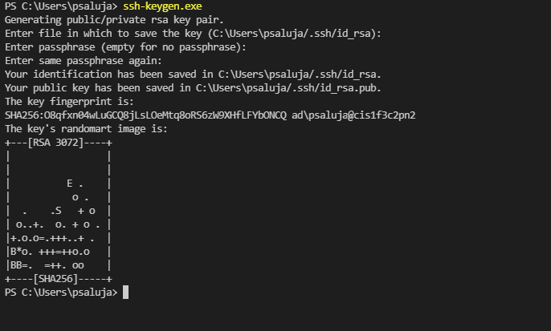
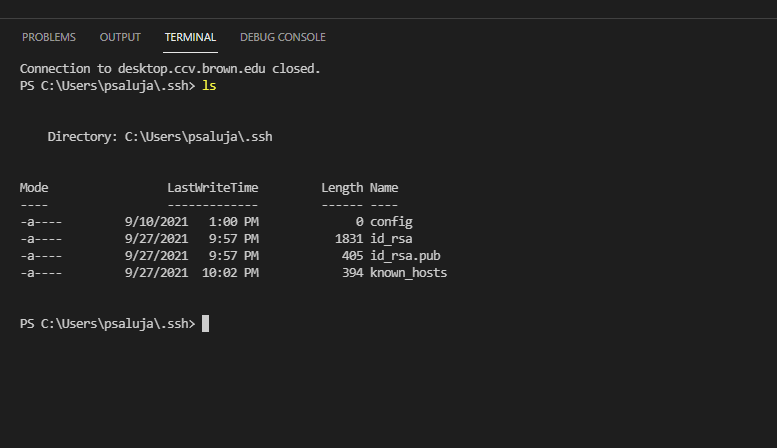
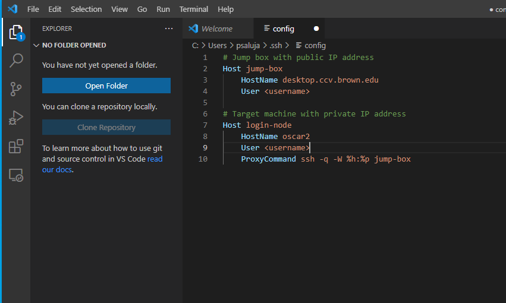
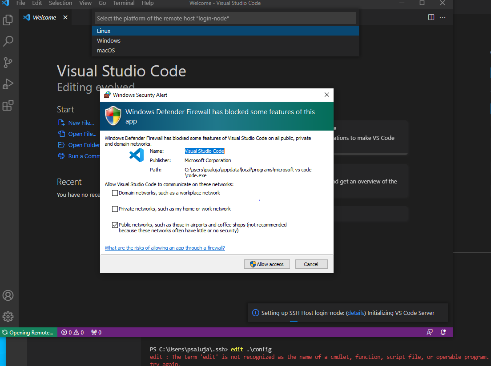

# VSCode setup on Windows

1. Install the [Remote Development extension pack](https://aka.ms/vscode-remote/download/extension) for VSCode


2. Setup ssh keys and password-less authentication 

* First we need to generate new key-pair, on the VSCode native terminal run `ssh-keygen.exe` and save the default settings



* Navigate to the `.ssh` directory on your local machine

```text
cd C:\Users\<uname>\.ssh
```



* Get the contents of `id_rsa.pub` file by `cat id_rsa.pub` . Copy the contents of this file, as we need to upload it to Oscar.

```text
cat id_rsa.pub
```

* Login into Oscar via regular ssh `ssh <username>@ssh.ccv.brown.edu`. Once you are on the login node, open the authorized\_keys file by `vim ~/.ssh/authorized_keys` file and add your public keys to  end of this file. Save and exit. 

3. Now on your local machine, we need to edit the `config` file. In your favorite text editor or VSCode open the `config` file in `.ssh` directory  and add the following contents to it:

```text
# Jump box with public IP address
Host jump-box
    HostName desktop.ccv.brown.edu
    User <username>

# Target machine with private IP address
Host login-node
    HostName oscar2
    User <username>
    ProxyCommand ssh -q -W %h:%p jump-box
```

Replace `<username>` with your Oscar username. 



4.  In VSCode, select  **Remote-SSH: Connect to Host…** and after the list populates select `login-node`


5. After a moment, VS Code will connect to the SSH server and set itself up. You might see the Firewall prompt, please click allow. 



6. Make sure follow symlinks is disabled. Navigate to **File** &gt; **Preferences** &gt; **Settings**

Search for `symlink` and make sure the symlink searching is unchecked


