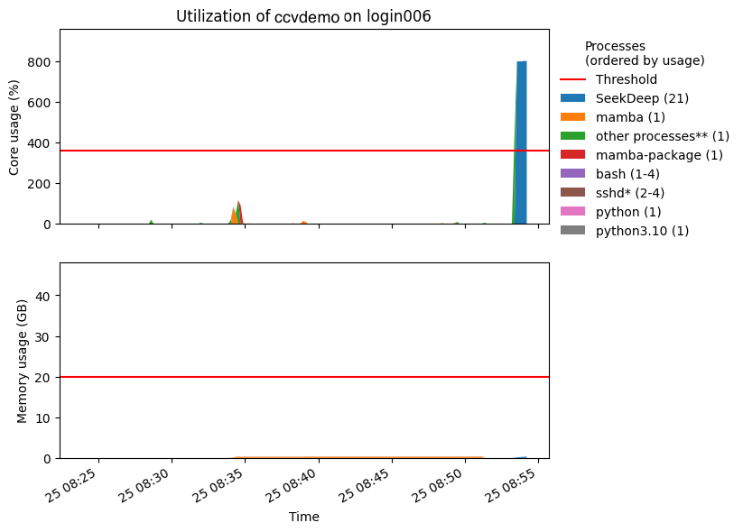

# Arbiter2

[Arbiter2 ](https://github.com/CHPC-UofU/arbiter2)is a cgroups-based mechanism that is designed to prevent the misuse of login nodes and VSCode node, which are scarce, shared resources. It is installed on shared nodes listed below:

* login005
* login006
* node1103 (VSCode)

## Status and Limits

Arbiter2 applies different limits to a user's processes depending on the user's status: normal, penalty1, and penalty2.


Arbiter2 limits apply only to the shared nodes, not compute nodes.


### Normal Limits

Upon first log in, the user is in the normal status. These normal limits apply to all the user's processes on the node:



1/3 of the total CPU time. For example, a user's processes can use up to 1/6 of the total CPU time of the 24 cores on a login node.&#x20;



40GB



### Penalty1 Limits

When a user's processes consume CPU time more than the default CPU time limit for a period of time, the user's status is changed to the penalty1 status. These penalty1 limits are applied:&#x20;



80% of the normal limit.&#x20;



0.8 \* 40GB = 32GB (80% of the normal limit)



While a user is in penalty1 status, their processes are throttled if they consume more CPU time than penalty1 limit. However, if a user's processes exceed penalty1 memory limit, the processes (PIDs) will be terminated by cgroups.

The user's status returns to the normal status after a user's processes consume CPU time less than the penalty1 limit for **30 minutes**.


Penalty restrictions are enforced independently for each shared node, and the penalty status does not carry over between these nodes.


### Penalty2 Limits

When a user's processes consume more CPU time than the penalty1 limit for a period of time, the user is put in the penalty2 status, and the penalty2 limits apply to the user's processes.



50% of the normal limit



20GB (50% of the normal limit)



In penalty2 status, the user's processes will be throttled if they consume more CPU time than penalty2 limit. However, if a user's processes exceed penalty2 memory limit, the processes (PIDs) will be terminated by cgroups.

The user's status returns to the normal status after a user's processes consume CPU time less than the penalty2 limit for **one hour**.

### Penalty3 Limits

When a user's processes consume more CPU time than the penalty2 limit for a period of time, the user is put in the penalty3 status. These penalty3 limits apply to the user's processes.&#x20;



30% of the normal limit



12GB (30% of the normal limit)



In penalty3 status, the user's processes will be throttled if they consume more CPU time than penalty3 limit. If a user's processes exceed penalty3 memory limit, the processes (PIDs) will be terminated by cgroups

The user's status returns to the normal status after a user's processes consume CPU time less than the penalty3 limit for **two hours**.

## Email Notification

A user receives an email notification upon each violation. Below is a example email:

### Violation of usage policy

A **violation of the usage policy** by **ccvdemo (CCV Demo,,,,ccvdemo**[**@brown.edu**](mailto:kevin\_wamae@brown.edu)**)** on login006 was automatically detected starting at 08:53 on 04/25.

This may indicate that you are running computationally-intensive work on the interactive/login node (when it should be run on compute nodes instead). Please utilize the 'interact' command to initiate a SLURM session on a compute node and run your workloads there.

You now have the status **penalty1** because your usage has exceeded the thresholds for appropriate usage on the node. Your CPU usage is now limited to 80% of your original limit (8.0 cores) for the next 30 minutes. In addition, your memory limit is 80% of your original limit (40.0 GB) for the same period of time.

**These limits will apply on login006.**

### High-impact processes

Usage values are recent averages. Instantaneous usage metrics may differ. The processes listed are probable suspects, but there may be some variation in the processes responsible for your impact on the node. Memory usage is expressed in GB and CPU usage is relative to one core (and may exceed 100% as a result).

| Process                 | Average core usage (%) | Average memory usage (GB) |
| ----------------------- | ---------------------- | ------------------------- |
| SeekDeep (21)           | 800.09                 | 0.24                      |
| mamba-package (1)       | 90.58                  | 0.01                      |
| other processes\*\* (1) | 3.48                   | 0.00                      |
| mamba (1)               | 1.90                   | 0.30                      |
| python3.10 (1)          | 0.56                   | 0.02                      |
| sshd\* (2-4)            | 0.01                   | 0.01                      |
| bash (1-4)              | 0.00                   | 0.01                      |
| python (1)              | 0.00                   | 0.01                      |

### Recent system usage

<figure><figcaption></figcaption></figure>

_\*This process is generally permitted on interactive nodes and is only counted against you when considering memory usage (regardless of the process, too much memory usage is still considered bad; it cannot be throttled like CPU). The process is included in this report to show usage holistically._

_\*\*This accounts for the difference between the overall usage and the collected PID usage (which can be less accurate). This may be large if there are a lot of short-lived processes (such as compilers or quick commands) that account for a significant fraction of the total usage. These processes are whitelisted as defined above._

## Required User Actions

When a user receives an alert email that the user is put in a penalty status, the user should

* kill the processes that use too much resources on the shared node listed in the alert email, and/or reduce the resources used by the processes
* submit an[ interactive job](../../submitting-jobs/interact.md), a [batch job](../../submitting-jobs/batch.md), or an [interactive Open OnDemand app](../open-ondemand/interactive-apps-on-ood.md) to run computational intensive programs including but not limited to Python, R and Matlab
* consider attending [CCV workshops or tutorials](https://events.brown.edu/ccv/all) to learn more about correctly using Oscar.


CCV reserves the right to suspend a user's access to Oscar, if the user repeatedly violates the limits, and the user is not able to work with CCV to find a solution.&#x20;


## Exempt Processes

Essential Linux utilities, such as rsync, cp, scp, SLURM commands, creating Singularity images, and code compilation, are exempt. To obtain a comprehensive list, please get in touch with us


The CPU resources used by exempt programs are not count against the CPU limits. However, the **memory resources** used by exempt program still counted against the memory limits.


