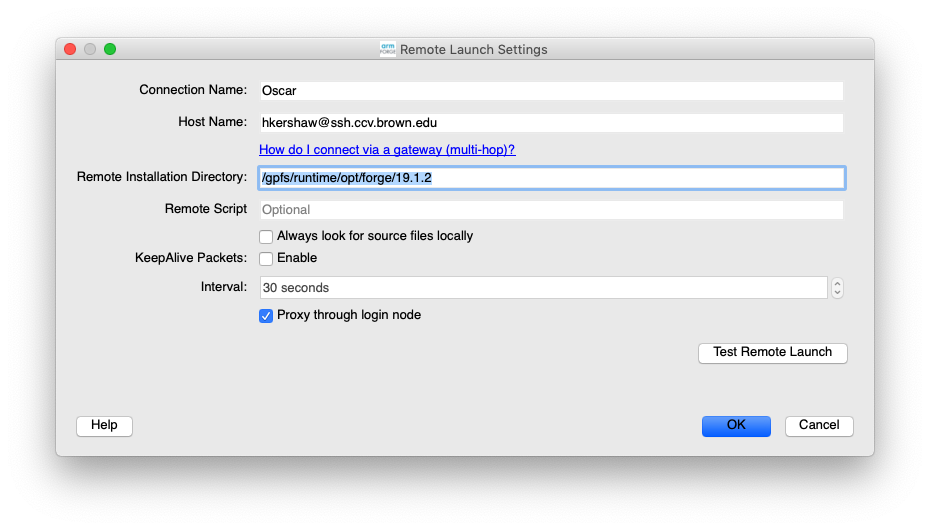
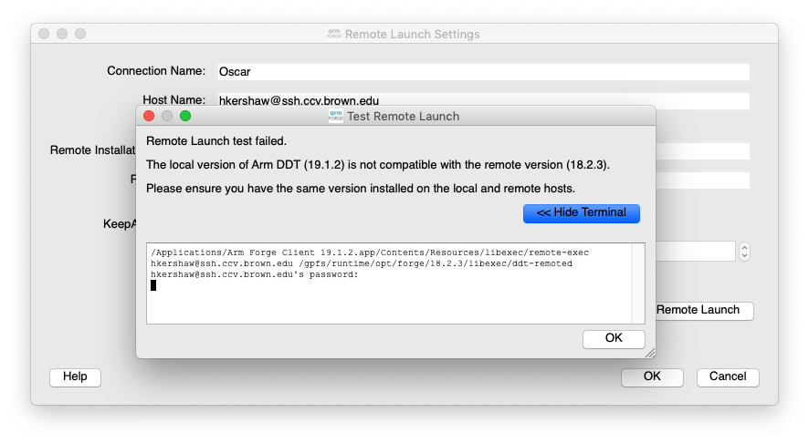
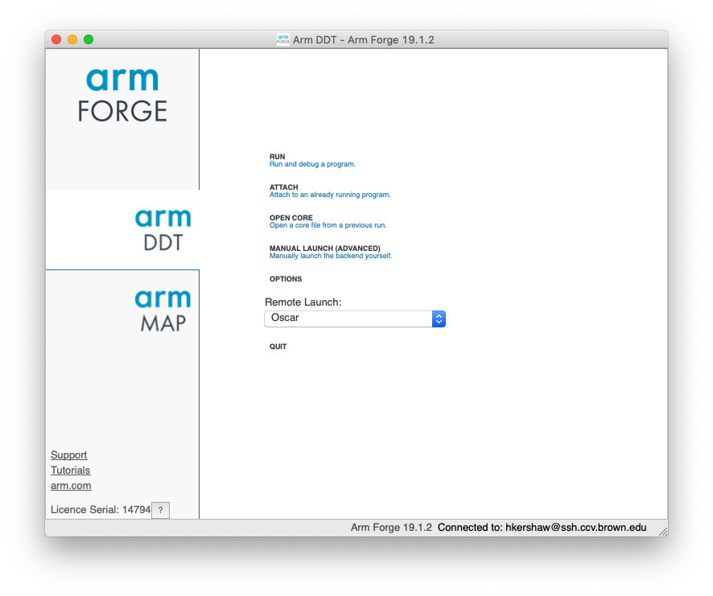

# Configuring Remote Launch

#### Configuring Remote Launch from the client

You will need to configure remote launch for Oscar

1. Open the client on your machine
2. Click 'Remote Launch' -&gt; Configure
3. Add  `username@ssh.ccv.brown.edu` as the Host Name
4. Add `/gpfs/runtime/opt/forge/19.1.2` as the Remote Installation Directory
5. Test Remote Launch.  You should enter the password used for Oscar.  If successful you should see the message `Remote Launch test completed successfully`


If you have a mismatch between your client version on the version of Forge on Oscar you will see an error message.   To fix this make sure you are using compatible client and remote versions



Once you are connected you will see a Licence checked out and  "Connected to username@ssh.ccv.brown.edu' on the client. 


