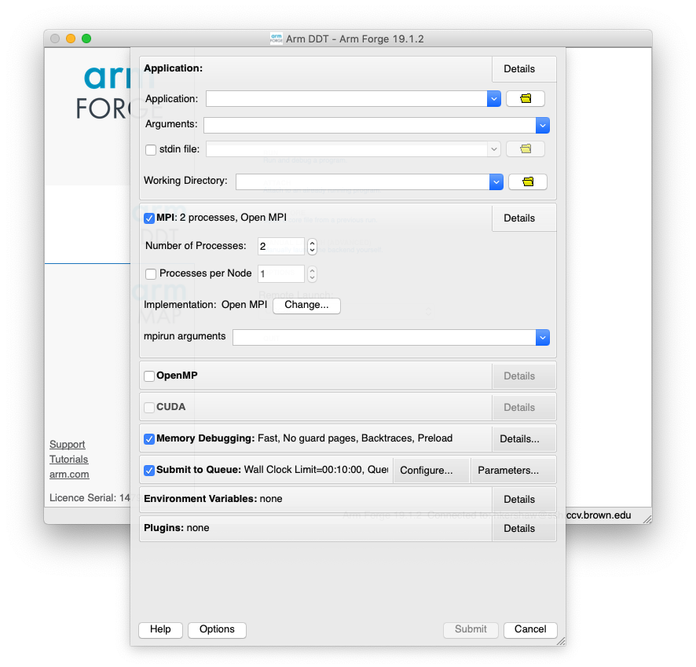

# Setting Job Submission Settings

We have provided templates for you to use for job submission settings.   These templates are in`/gpfs/runtime/opt/forge/19.1.2/templates`

 Click `Run and debug a program` to open the following menu

Click `Configure` next to **Submit to Queue** and enter `/gpfs/runtime/opt/forge/19.1.2/templates/slurm-ccv.qtf` as the Submission template file


`slurm-ccv-qtf`  lets you specify the total number of tasks.  The number of tasks may not be equal for each node.   This option will be the shortest time in the queue, but may not give you consistent run times. 

`slurm-ccv-mpi.qtf` is for MPI jobs where you want to specify number of nodes and tasks per node

`slurm-ccv-threaded.qtf` is for threaded \(single node\) jobs


