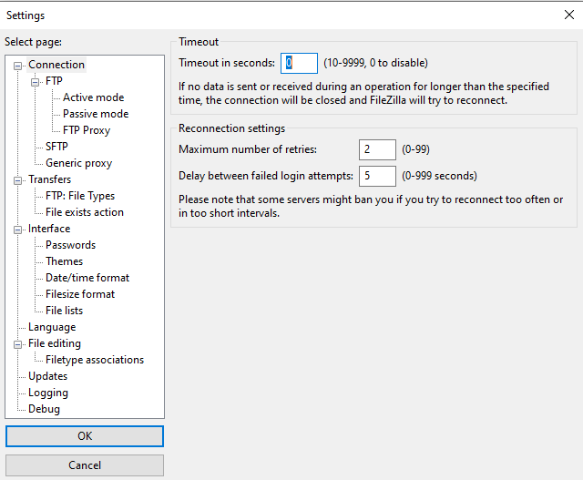
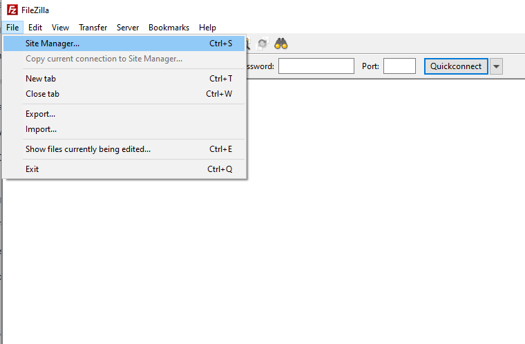
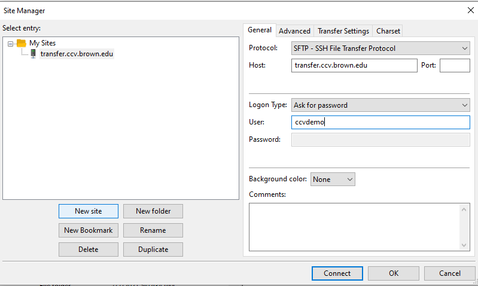
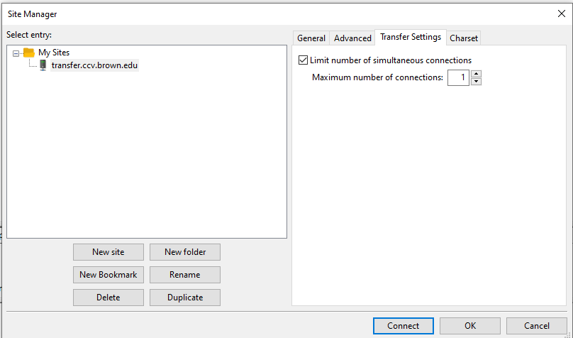
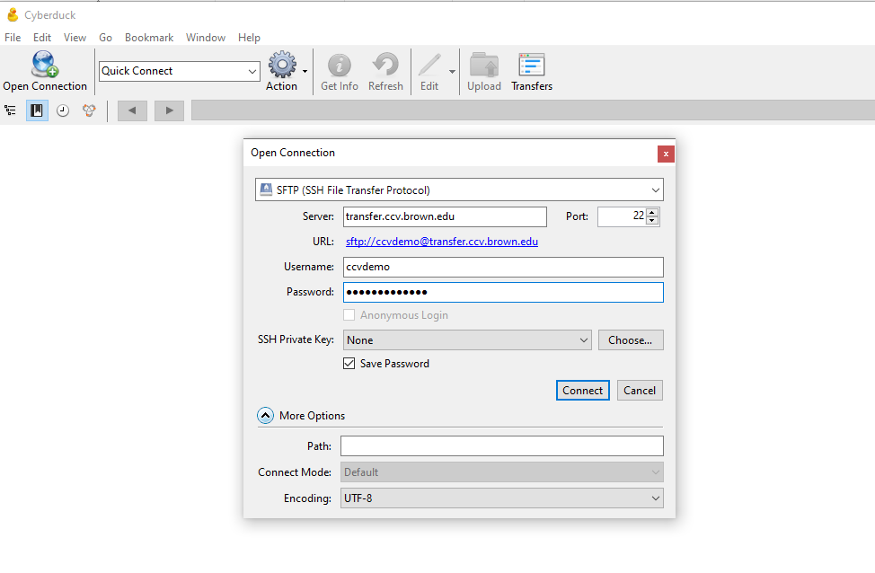
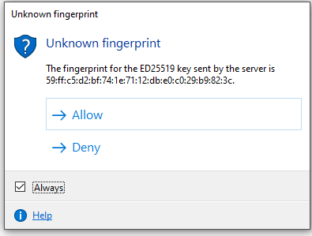

# Transferring Files to and from Oscar

There are several ways to move files between your machine and Oscar. Which method you choose will depend on how much data you need to move and your personal preference for each method.

1. [CIFS](../connecting-to-oscar/cifs.md)
2. [Command line](filetransfer.md#2-command-line) \(scp\)
3. [GUI application](filetransfer.md#3-gui-programs-for-transferring-files-using-the-scp-or-sftp-protocol)
4. [Globus online](filetransfer.md#4-globus-online) \(best for large transfers\)

## 1. SMB

You can drag and drop files from your machine to the Oscar filesystem via SMB. This is an easy method for a small number of files. Please refer to this [page](https://docs.ccv.brown.edu/oscar/connecting-to-oscar/cifs) for mounting filesystem via SMB. 

## 2. Command line

**Mac and Linux**

**SCP**

You can use `scp` to transfer files. For example to copy a file from your computer to Oscar:

```text
scp /path/to/source/file <username>@transfer.ccv.brown.edu:/path/to/destination/file
```

To copy a file from Oscar to your computer:

```text
scp <username>@transfer.ccv.brown.edu:/path/to/source/file /path/to/destination/file
```

**RSYNC**

You can use `rsync` to sync files across your local computer to Oscar:

```text
rsync -azvp --progress path/to/source/directory <username>@transfer.ccv.brown.edu:/path/to/destination/directory
```

**Windows** On Windows, if you have PuTTY installed, you can use it's `pscp` function from the terminal.

## 3. GUI programs for transferring files using the `scp`  protocol

In general, you can specify the followings for your GUI programs:

* Protocol: SFTP
* Host: transfer.ccv.brown.edu
* User: your Oscar username
* Password: your Oscar password

### 3.1 [WinSCP](https://winscp.net/eng/index.php) for Windows


### 3.2 FileZilla

#### 3.21. Disable Timeout

**Click the 'Edit' menu and then select the 'Settings' submenu, and then change the Timeout to 0 to disable, as shown in Figure 2**




#### 3.2.2 Add a New Site

**Open the Site Manager as show in Figure 3.**



**Click the 'New Site' button to add a new site, as shown in Figure 4:**



**Limit the number of simultaneous connections to 1, as shown in Figure 5.**



Click the 'Connect' button to connect to Oscar and transfer files.

### 3.3 Cyberduck



You may see a popup window on 'Unknown Fingerprint'.  You just need to check the 'Always' option and click 'Allow'. This is windows should not pop up again unless the transfer server is changed again.



## 4. Globus online

[Globus](https://www.globus.org) is a secure, reliable research data management service. You can move data directly to Oscar from anothe Globus endpoint. Oscar has one Globus endpoint:

```text
BrownU_CCV_Oscar
```

If you want to use Globus Online to move data to/from you own machine, you can install Globus Connect Personal. For more instructions on how to use Globus, see the [Oscar section](https://docs.ccv.brown.edu/globus/creating-endpoints/using-globus-with-oscar) in the Globus documentation.

