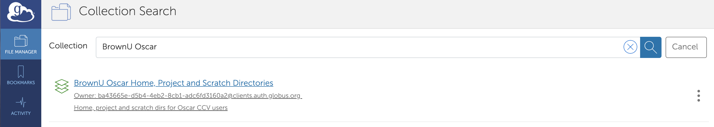

# Using Globus

Globus Online provides a transfer service for moving data between institutions such as Brown and XSEDE facilities. You can also use Globus to transfer files between these institutions and your local machine. Files can be transferred using the Globus web interface or the command-line interface.

### Using Globus

1. Navigate to [https://www.globus.org/](https://www.globus.org/)
2. Log in to use Globus Web App and select Brown University as Organization. 


3. The page will redirect to the SSO Authentication page. Use your AD credentials.


4. Navigate to File Manager, and under collections search for Oscar's endpoint:

```text
BrownU Oscar Home, Project and Scratch Directories
```



5. If you want to use Globus Online to move data to/from your own machine, you can install Globus Connect Personal. Installing Globus Connect Personal allows you to create an endpoint on your computer that you can use to transfer data to and from your computer. For installation, if you have started a transfer between two remote machines you don't have to keep your computer connect to Globus. When the transfer is complete you will receive an email.  details see: [https://www.globus.org/globus-connect-personal](https://www.globus.org/globus-connect-personal)

6. You can then select the files you want to transfer. And click the 'Start' button below. 

7. You should see "Transfer request submitted successfully" and an id for the transfer. 

**Note if you are using Globus Connect Personal for a transfer to/from your machine, Globus personal will need to stay running on your machine for the transfer to complete.**

## Tips for Transferring Data between Globus and Google Drive

For Google Drive, there are "rates limits" on how much data and how many files a user can transfer in any 24 hours period. The following two tips can help to alleviate the restrictions from the rates limits:

* transfer a subfolder as a job. A user can submit 2-3 jobs at a time
* compress the folder or subfolders with a lot of small files, e.g., using tar, before the transfer

