# Using Globus

Globus Online provides a transfer service for moving data between institutions such as Brown and XSEDE facilities. You can also use Globus to transfer files between these institutions and your local machine. Files can be transferred using the Globus web interface or the command-line interface.

## Access Oscar Collection

1. Navigate to [https://www.globus.org/](https://www.globus.org/), then click the 'Login' button in Figure 1.                                          

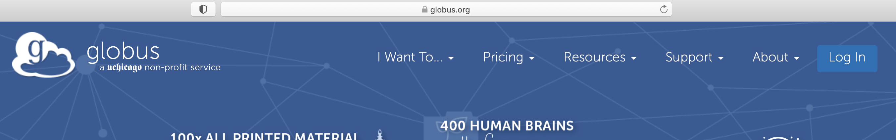

2. Select Brown University as Organization, then click 'Continue' in Figure 2.

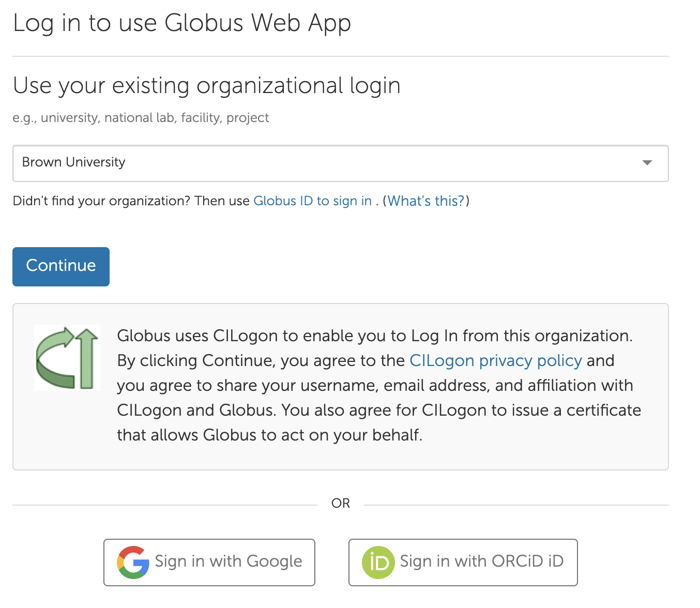

3. The page will redirect to the SSO Authentication page. Use your AD credentials.

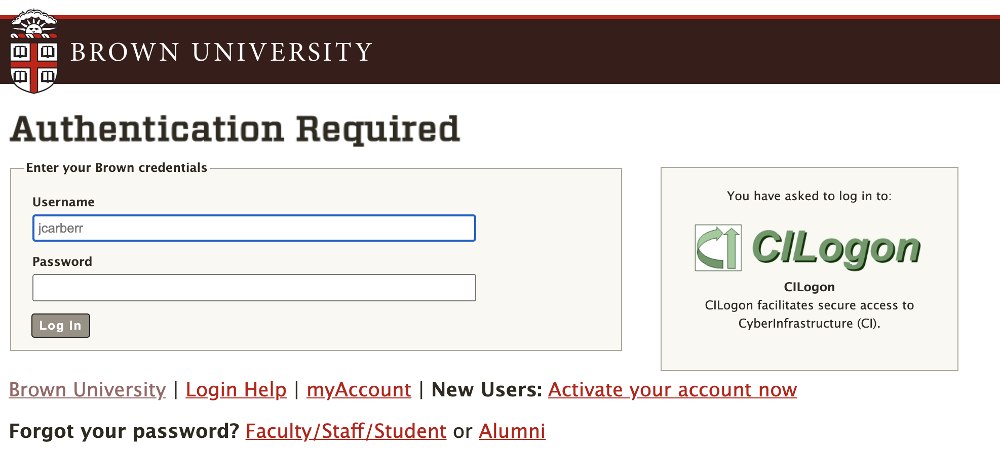

4. Navigate to File Manager, and enter 'BrownU\_CCV\_Oscar' in Collection Search as shown in Figure 4:

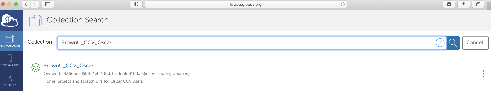

5.  Click the BrownU\_CCV\_Oscar in the list from Collection Search, if it is your first time to access the BrownU\_CCV\_Oscar collection \(Step 5 - 7\),  click the 'Continue' button in Figure 5 to be authenticated.

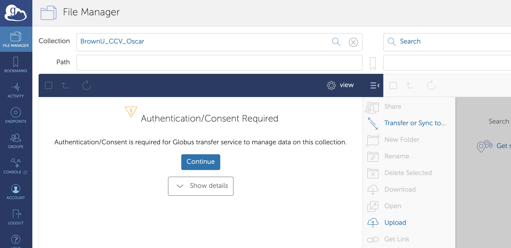

6. Click the your\_brown\_id@brown.edu in Figure 6.

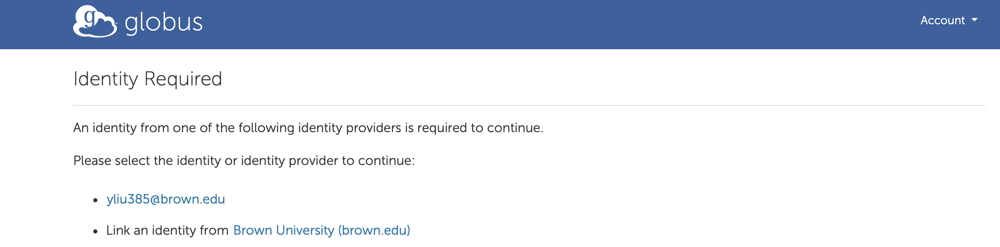

7. Click the 'Allow' button in Figure 7 to grant permissions to Globus Web App. You should read the Terms of Service and Privacy Policy.

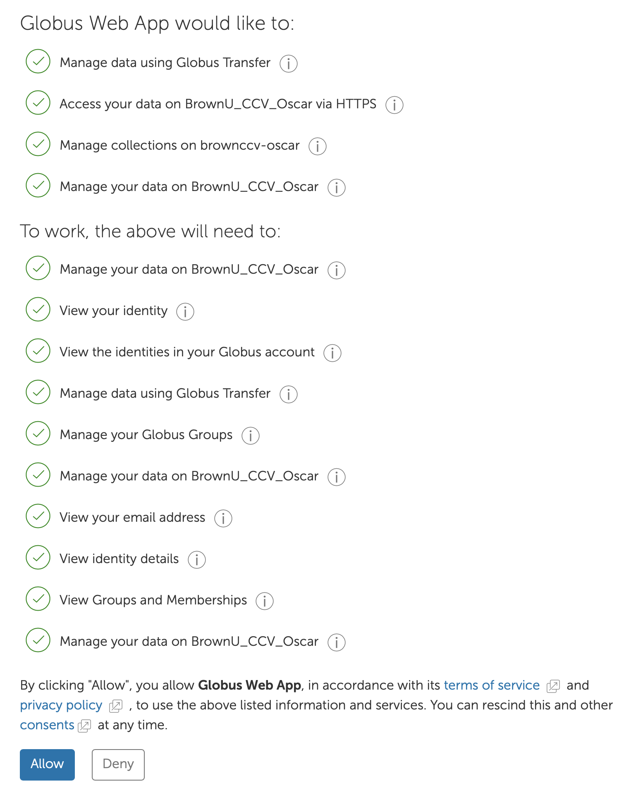

8. After authentication, the collection is displayed in File Manager as shown in Figure 8.

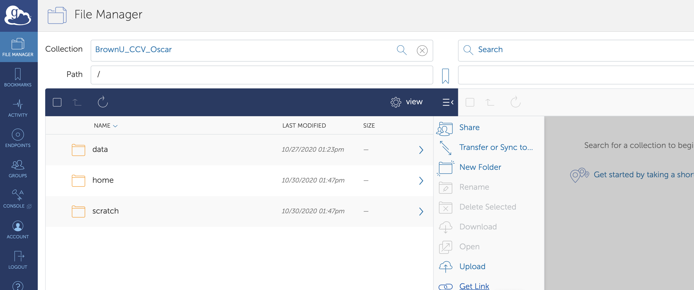

9.  You may navigate through directories by clicking on them or entering one of the following in the 'Path' textbox:

* data directory - /data/&lt;pi\_group&gt;/&lt;user\_name&gt;/&lt;folder\_name&gt;
* scratch directory - /scratch/&lt;user\_name&gt;/&lt;folder\_name&gt;
* home directory - /home/&lt;user\_name&gt;/&lt;folder\_name&gt;

Note that the &lt;pi\_group&gt;, &lt;user\_name&gt;, &lt;folder\_name&gt; should be replaced by a PI's group, an Oscar username, and the actual folder name to access, as illustrated in Figure 9.

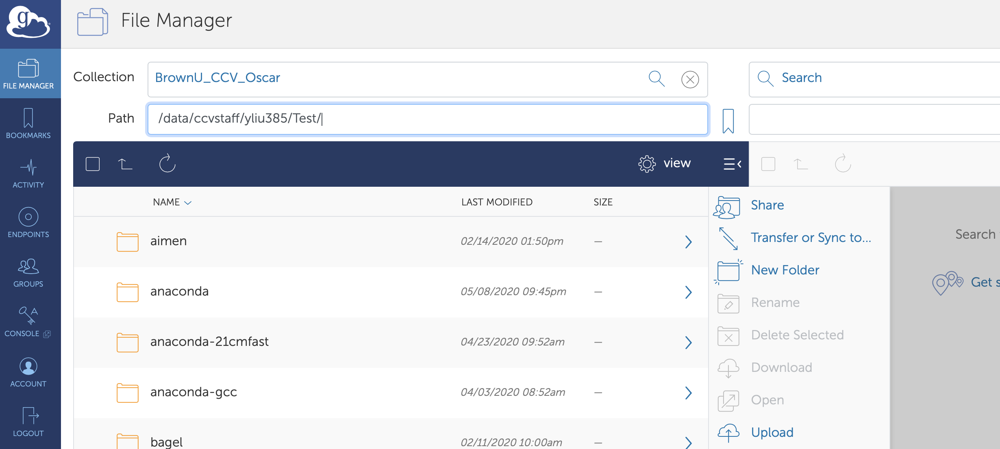

10. You may bookmark your selected folder, by clicking the Bookmark icon which is to the right of the Path search textbox, entering the name for the selected folder, and then click the 'Create Bookmark' button as shown in Figure 10.  After that, a confirmation will be displayed as in Figure 11. Once a bookmark is saved, you can access it later by clicking the 'BOOKMARKS' icon in the left panel,  and then click the bookmark from the list of your saved bookmarks, as shown in Figure 12.

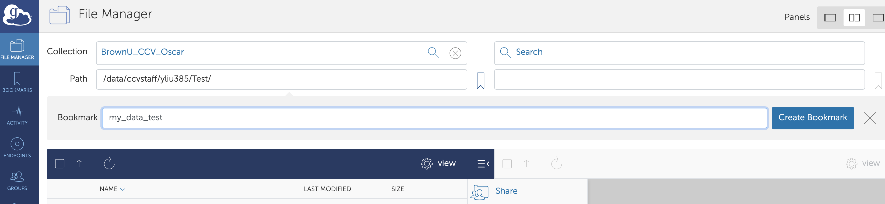

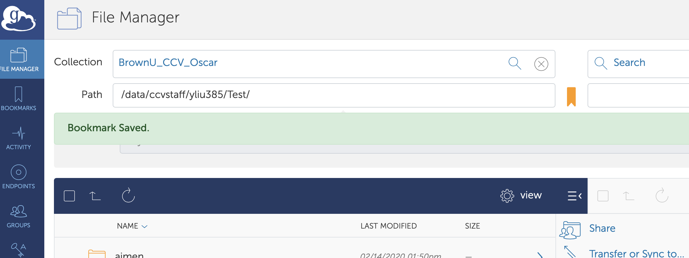

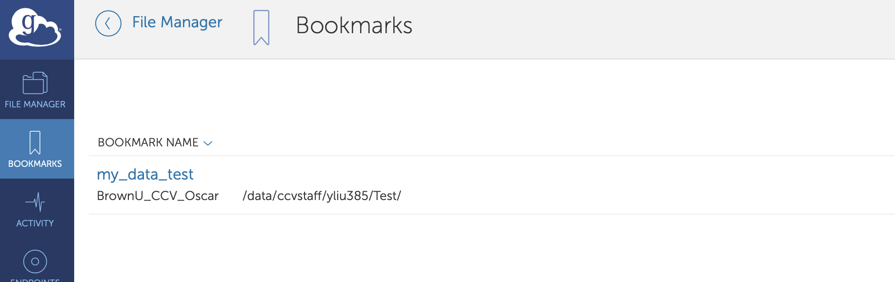

## Transfer data

11. If you want to use Globus Online to move data to/from your own machine, you can install Globus Connect Personal. Installing Globus Connect Personal allows you to create an endpoint on your computer that you can use to transfer data to and from your computer. For installation, if you have started a transfer between two remote machines you don't have to keep your computer connect to Globus. When the transfer is complete you will receive an email.  details see: [https://www.globus.org/globus-connect-personal](https://www.globus.org/globus-connect-personal)

12. You can then select the files you want to transfer. And click the 'Start' button below. 

13. You should see "Transfer request submitted successfully" and an id for the transfer. 

**Note if you are using Globus Connect Personal for a transfer to/from your machine, Globus personal will need to stay running on your machine for the transfer to complete.**

### Tips for Transferring Data between Globus and Google Drive

For Google Drive, there are "rates limits" on how much data and how many files a user can transfer in any 24 hour period. The following two tips can help to alleviate the restrictions from the rates limits:

* Transfer a subfolder as a job. A user can submit 2-3 jobs at a time.
* If the folder or subfolder contains a lot of small files, compress the folder or subfolders using zip or tar before the transfer.

