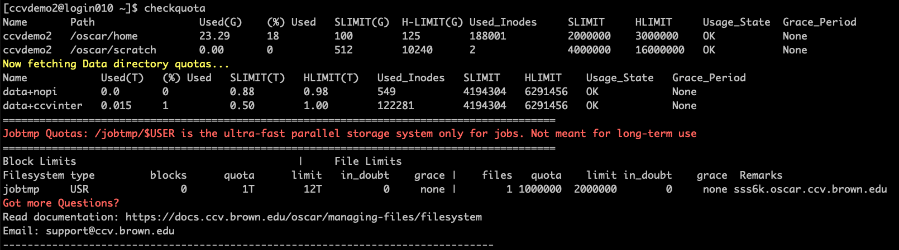
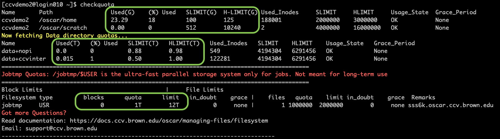
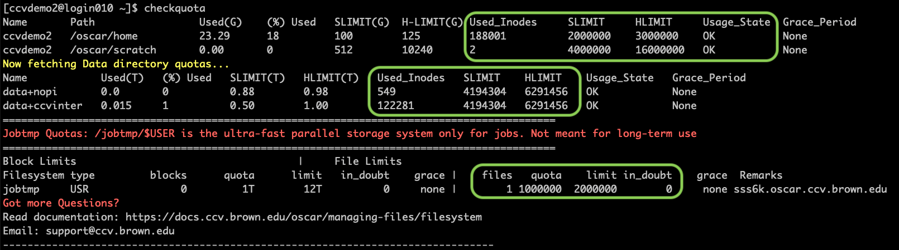

# Understanding Disk Quotas

## Checkquota

Use the command `checkquota` to view your current disk usage and quotas. Here's an example output of this command

<figure><figcaption><p>Screenshot of the command <code>checkquota</code></p></figcaption></figure>

```
[ccvdemo2@login010 ~]$ checkquota
Name       Path                 Used(G)    (%) Used   SLIMIT(G)  H-LIMIT(G) Used_Inodes     SLIMIT     HLIMIT     Usage_State  Grace_Period
ccvdemo2   /oscar/home          23.29      18         100        125        188001          2000000    3000000    OK           None
ccvdemo2   /oscar/scratch       0.00       0          512        10240      2               4000000    16000000   OK           None
Now fetching Data directory quotas...
Name            Used(T)   (%) Used   SLIMIT(T)   HLIMIT(T)   Used_Inodes   SLIMIT    HLIMIT    Usage_State   Grace_Period
data+nopi       0.0       0          0.88        0.98        549           4194304   6291456   OK            None
data+ccvinter   0.015     1          0.50        1.00        122281        4194304   6291456   OK            None
==========================================================================================
Jobtmp Quotas: /jobtmp/$USER is the ultra-fast parallel storage system only for jobs. Not meant for long-term use
==========================================================================================
Block Limits                                    |     File Limits
Filesystem type         blocks      quota      limit   in_doubt    grace |    files   quota    limit in_doubt    grace  Remarks
jobtmp     USR               0         1T        12T          0     none |        1 1000000  2000000        0     none sss6k.oscar.ccv.brown.edu
Got more Questions?
Read documentation: https://docs.ccv.brown.edu/oscar/managing-files/filesystem
Email: support@ccv.brown.edu
--------------------------------------------------------------------------------
```

Each line represents a top level directory that you have access to.

Each column represents a usage or quota for these directories.

## Types of Quota:

Disk usage and quotas are calculated separately for [top level directories](../filesystem.md). Two types of quotas are calculated for each of these directories:

### Disk space usage

This usage is expressed in Gigabytes (G) or Terabytes (T) . This is the total size of all the files in that directory and it does not depend upon the number of files. Run the command checkquota to see your disk usage and quota. Here's an example:

<figure><figcaption></figcaption></figure>

### Inode usage

This is the total number of files and directories in the particular directory. This number does not depend upon the size of the files. Run the command checkquota to see your inode usage and quota. Here's an example:

<figure><figcaption></figcaption></figure>

## Soft Limits vs Hard Limits

All quotas have a soft limit (SLimit) and hard limit (HLimit). When usage exceeds the soft limit, a grace period associated with this limit begins. During the grace period, the usage is allowed to increase up to the hard limit. When the usage reaches the hard limit or when the grace period expires, the user is not allowed to write any files to that particular directory.

## Usage State

The "Usage State" column shows the status of the grace period for a particular directory. Here are some of the status messages:

### `SOFT_EXCEEDED`

This indicates that your usage of the disk space or inodes has exceeded the soft limit and you are still within the grace period. Check the `Grace_Period` column to see the number of days left in the grace period. You may continue writing data into this directory until the end of the grace period, as long as you do not exceed the hard limit

### `GRACE_EXPIRED`

This indicates that your usage has exceeded the soft limit AND the grace period has expired. You will not be able to write data into that directory, but you can remove files.

### `HARD_EXCEEDED`

This indicates that your usage has reached the hard limit. You will not be able to write data into that directory, but you can remove data.

### `OK`

This indicates that your usage of the disk space as well as inodes in within the soft quota.

