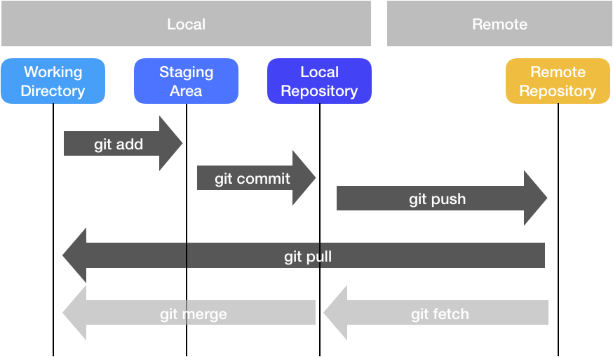

# Version Control

### Git Overview

Version Control refers to the management of changes made to source code or any such large amount of information in a robust manner by multiple collaborators. Git is by far the most popular version control system. &#x20;

Git enables effective collaboration among developers. In a team setting, multiple developers often work on the same project simultaneously. With Git, each developer can work on their own local copy of the project, making changes and experimenting freely without affecting the main codebase. Git allows developers to merge their changes seamlessly, ensuring that modifications made by different individuals can be consolidated efficiently. It provides mechanisms to track who made specific changes, making it easier to understand the evolution of the project and identify potential issues.


### Git Workflow

Nearly all operations that are performed by Git are in you local computing environment, for the exception of few used purely to synchronize with a remote. Some of the most common git operations are depicted below. In summary a typical flow consists of making changes to your files, _staging_ them via `git add`, marking a save point via `git commit`, then finally syncing to your remote (e.g., GitHub) via `git push`. If you are pushing changes to your remote from multiple places, you can bring changes your most recent version using `git pull`, which is the equivalent of doing `git fetch` followed by a `git merge` operation

<figure><figcaption></figcaption></figure>

### Cheatsheet

Below are some of the most commonly used Git commands. You can also get much more information by running `git --help`. And if you'd like to learn more there is an [excellent and thorough tutorial on Atlassian's website.](https://www.atlassian.com/git/tutorials/what-is-version-control)


<table><thead><tr><th width="385">Command</th><th>Summary</th></tr></thead><tbody><tr><td><code>git add &#x3C;FILENAME></code></td><td>Add files to staging area for next commit</td></tr><tr><td><code>git commit -m "my awesome message"</code></td><td>Commit staged files </td></tr><tr><td><code>git push</code></td><td>Upload commit to remote repository</td></tr><tr><td><code>git pull</code></td><td>Get remote repo's commits and download (try and resolve conflicts)</td></tr><tr><td><code>git clone &#x3C;URL></code></td><td>Download entire remote repository</td></tr></tbody></table>

### Git Configuration

While using Git on Oscar, make sure that you [configure Git](https://www.atlassian.com/git/tutorials/setting-up-a-repository/git-config) to have your correct Name and Email ID to avoid confusion while working with remote repositories (e.g., GitHub, GitLab, BitBucket).

```bash
$ git config --global user.name "John Smith“
$ git config --global user.email john@example.com
```

### Getting Out of Trouble

Git can sometimes be a bit tricky. And we all eventually find ourselves in a place where we want to undo something or fix a mistake we made with Git. [This website](https://ohshitgit.com/) (pardon the profanity) has a bunch of really excellent solutions to common problems we sometimes run in to with Git.
