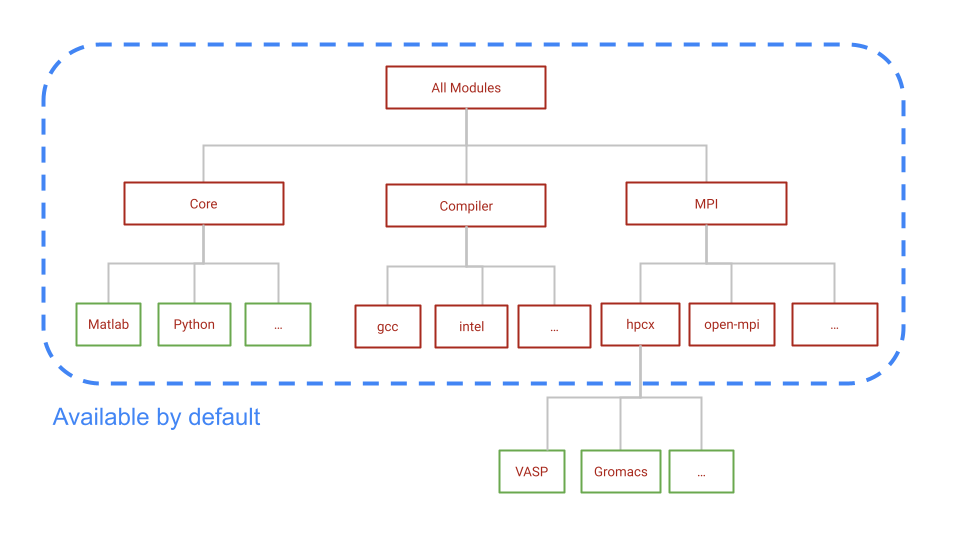

# LMOD - New Module System


Advanced users can skip to the [summary](lmod-new-module-system.md#summary) at the bottom of this page


These are the major changes after the January 2024 maintenance

1. **New Module System (LMOD)**: All software modules have been reinstalled. Version names for all modules will be slightly different.  The output from commands like "module avail" and "module load" will be different.
2. **New Operating System**: The operating system is upgraded to RHEL 9.2
3. MPI programs are compiled with HPCX MPI, the new industry standard
4. Python packages will not be installed as modules; users can install these packages in their home directories -> Users have better control based upon their specific requirements
5. Python2 is not longer available as a system-installed program

Users need to make the following changes:

* Job Scripts:
  * Module names
  * Order of loading is important for MPI applications. Load the MPI module first.
* Application changes:
  * User-installed applications may need to be reinstalled, if they do not work correctly.
  * Python and  Conda environments, R packages may need to be reinstalled.
    * Use `python -m venv` instead of `virtualenv` for Python environments

## LMOD - Hierarchical Module System

The older module system has a flat structure. This meant that all the modules and their versions were available for you to load. The compiler version and MPI version required for a particular module were indicated, either as a suffix to the version number, or as a message after loading the module.

LMOD is hierarchical. The schematic below shows that the three different types of modules available to you after logging in.&#x20;

1. Core: Softwares that are precompiled binaries or compiled with system compiler (GCC 11.3.0)&#x20;
2. Compiler: Versions of compilers like GCC, Intel
3. MPI: MPI implementations

As shown in the schematic, Core, compiler and mpi modules are available by default. You can see the list of these modules by running the command `module avail`

<figure><figcaption></figcaption></figure>

To load the modules compiled with MPI, you need to load the corresponding MPI modules first. For example, `Gromacs` module is not available until you load the `hpcx-mpi` module.

You may refer to[ this table](module-changes.md) for new module names corresponding to older Oscar modules.

### Module commands:

To load a module, you need to run the command `module load <name>` . You can see all the available LMOD subcommands by running `module --help.` Here are some of the useful commands.&#x20;


Unlike Pymodules, LMOD will load the dependencies for a package automatically.


| Command                | Shorter command |                                                                                                                                                                                                                                      |
| ---------------------- | --------------- | ------------------------------------------------------------------------------------------------------------------------------------------------------------------------------------------------------------------------------------ |
| module list            | ml              | Lists all modules that are currently loaded in your software environment.                                                                                                                                                            |
| module avail \<string> | ml av \<string> | List available modules that contain "\<string>"                                                                                                                                                                                      |
| module load \<name>    | ml \<name>      | Adds a module to your current environment. If you load using just the name of a module, you will get the default version. To load a specific version, load the module using its full name with the version: "module load fftw/2.1.5" |
| module unload \<name>  |                 | Removes a module from your current environment.                                                                                                                                                                                      |
| module purge           |                 | Unloads ALL modules                                                                                                                                                                                                                  |
| module show \<name>    |                 | show the commands in the module file                                                                                                                                                                                                 |
| module spider \<name>  |                 | Lists all possible versions of \<name>. This includes modules that are NOT core modules.                                                                                                                                             |

## Summary

* LMOD is hierarchical. By default, core, compiler and mpi modules are available.
* Modules compiled with a different compiler are NOT available unless you load that compiler.
* To load modules compiled with MPI, load the MPI module first.
* Run `module spider <string>` to find all possible module name and versions
* Run `module --help` to see all available subcommands.
