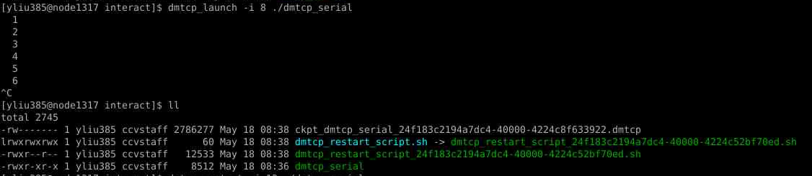
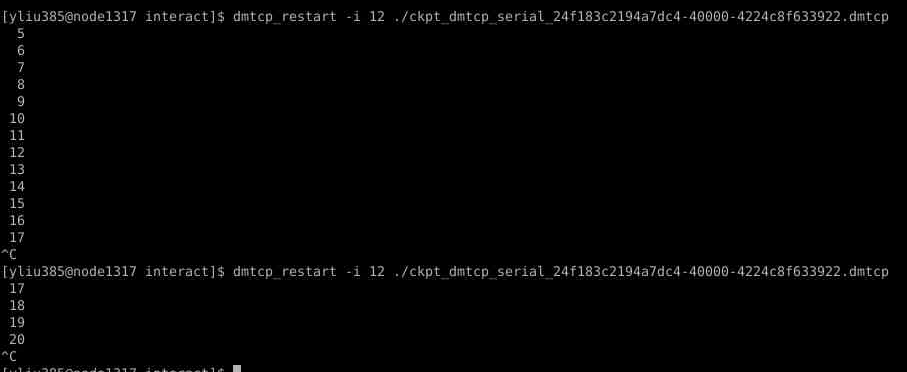

# DMTCP


<mark style="color:red;">**This page is under construction!**</mark>


[Distributed Multithreaded checkpointing](https://dmtcp.sourceforge.io/) (DMTCP) checkpoints a running program on Linux with no modifications to the program or OS. It allows to restart running the program from a checkpoint.&#x20;

To access dmtcp, load a dmtcp module. For example:

`module load dmtcp/2.6.0`

## `Example Programs`

`The following example programs can be copied from /gpfs/runtime/`oftware\_examples/dmtcp/

* dmtcp\_serial
* dmtcp\_serial.c

## Basic Usage

### Launch a Program

The `dmtcp_lanuch` command launches a program, and automatically checkpoints the program. To specify the interval (seconds) for checkpoints, add the "`-i num_seconds`" option to the `dmtcp_lauch` command.&#x20;

**Example:** the following command launches the program `dmtcp_serial` and checkpoints every 8 seconds (Figure 1).

`dmtcp_launch -i 8 ./a.out`

As shown in Figure 1, a checkpoint file (ckpt\_\*.dmtcp) is created, and can be used to restart the program

### Restart from a checkpoint

The dmtcp\_resart command restarts a program from a checkpoint, and also automatically checkpoints the program. To specify the interval (seconds) for checkpoints, add the "`-i num_seconds`" option to the `dmtcp_restart` command.&#x20;

**Example:** the following command restarts the dmtcp\_serial program from a checkpoint, and checkpoints every 12 seconds

`dmtcp_restart -i 12`&#x20;

As shown in Figure 2, the second run of the `dmtcp_restart` command starts from the checkpoint saved by the first run of the `dmtcp_restart` command. _``_&#x20;

