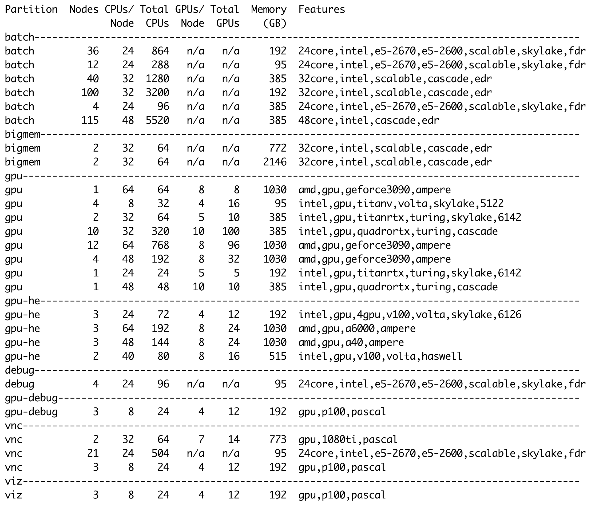

# System Hardware

## Oscar Specifications

|                        |       |
| ---------------------- | ----- |
| **Compute Nodes**      | 393   |
| **Total CPU Cores**    | 14136 |
| **GPU Nodes**          | 57    |
| **Total GPUs**         | 385   |
| **Large Memory Nodes** | 4     |

## Compute Nodes

Oscar has compute nodes in the partitions listed below.

* **batch** - The batch partition is for programs/jobs which need neither GPUs nor large memory.
* **bigmem** - The bigmem partition is for programs/jobs which require large memory.&#x20;
* **debug** - The debug partition is for users to debug programs/jobs.
* **gpu** - The gpu partition is for programs/jobs which require GPUs.
* **gpu-debug** - The gpu-debug partition is for users to debug gpu programs/jobs.&#x20;
* **gpu-he** -The gpu-he partition is for programs/jobs which need to access high-end GPUs.&#x20;
* **vnc** - The vnc partition is for users to run programs/jobs in an graphical desktop environment.&#x20;

Below are node details including cores and memory for all partitions.

| **Partition** | 
<strong>Total</strong> <strong>Nodes</strong>
 | 
<strong>Total</strong> <strong>Cores</strong>
 | 
<strong>Cores</strong> <strong>Per Node</strong>
 | 
<strong>Total</strong> <strong>GPUs</strong>
 | 
<strong>Memory Per</strong> <strong>Node (GB)</strong>
 |
| ------------- | ------------------------------------------------------- | ------------------------------------------------------- | ---------------------------------------------------------- | ------------------------------------------------------ | ---------------------------------------------------------------- |
| batch         | 307                                                     | 11248                                                   | 24-48                                                      | n/a                                                    | 95-385                                                           |
| bigmem        | 4                                                       | 128                                                     | 32                                                         | n/a                                                    | 772-2146                                                         |
| gpu           | 35                                                      | 1512                                                    | 8-64                                                       | 277                                                    | 95-1030                                                          |
| gpu-he        | 11                                                      | 488                                                     | 24-64                                                      | 76                                                     | 192-1030                                                         |
| debug         | 4                                                       | 96                                                      | 24                                                         | n/a                                                    | 95                                                               |
| gpu-debug     | 3                                                       | 24                                                      | 8                                                          | 12                                                     | 192                                                              |
| vnc           | 26                                                      | 592                                                     | 8-32                                                       | 26                                                     | 95-773                                                           |
| viz           | 3                                                       | 24                                                      | 8                                                          | 12                                                     | 192                                                              |

## Hardware details

Hardware details for all partitions. The Features column shows the features available for the --constraint option for SLURM. This includes the available CPU types as well GPUs.

