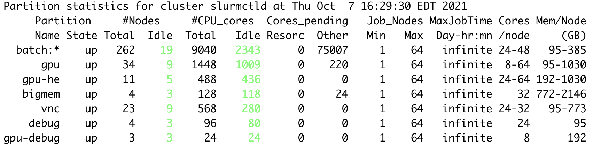

# System Hardware

## Oscar Specifications

| Category | Specifications |
| :--- | :--- |
| Computer Nodes | 341 |
| GPU Nodes | 45 |
| Login Nodes | 2 |
| Large Memory Nodes \(&gt;512GB\) | 4 |
| Total CPU Cores | 11792 |
| Total GPUs | 199 |
| Total Storage \(GPFS Filesystem\) | 3.27PB |
| Operating Systems | RedHat EL 7.3 \(Linux\) |
| Job Scheduler | Slurm Workload Manager |

## Active Nodes per partition

## Compute Nodes

Oscar has 425 compute nodes including 27 GPU nodes in the batch, gpu, gpu-he, vnc, bigmem, and debug partitions.


Nodes could be down for repair. Use the `sinfo` command to check node status on Oscar.


### batch

The batch partition is for programs/jobs which need neither GPUs nor large memory. There are 362 nodes in the batch partition.

| Model | Cores per Node | Memory \(GB\) | Node Count | GPU \(GPU Memory\) |
| :--- | :--- | :--- | :--- | :--- |
| Intel Broadwell \(ES-2650 v3\) | 20 | 125 | 4 | n/a |
| Intel Broadwell \(ES-2650 v4\) | 24 | 125 | 51 | n/a |
| Intel Skylake  \(Gold 6126\) | 24 | 187 | 44 | n/a |
| Intel Skylake  \(Gold 6126\) | 24 | 93 | 47 | n/a |
| Intel Cascade Lake \(Gold 6242\) | 32 | 376 | 40 | n/a |
| Intel Cascade Lake \(Gold 6242\) | 32 | 187 | 100 | n/a |
| Intel Cascade Lake \(Platinum 8268\) | 48 | 376 | 76 | n/a |
| Total | 10960 |  | 332 |  |

### bigmem

The bigmem partition is for programs/jobs which require large memory. There are 4 nodes in the bigmem partition.

| Model | Cores per Node | Memory \(GB\) | Node Count | GPU \(GPU Memory\) |
| :--- | :--- | :--- | :--- | :--- |
| Intel Cascade Lake \(Gold 6242\) | 32 | 2096 | 2 | n/a |
| Intel Cascade Lake \(Gold 6242\) | 32 | 754 | 2 | n/a |
| Total | 128 |  | 4 |  |

### debug

The debug partition is for users to debug programs/jobs. There are 7 nodes in the debug partition. 

| Model | Cores per Node | Memory \(GB\) | Node Count | GPU \(GPU Memory\) |
| :--- | :--- | :--- | :--- | :--- |
| Intel Haswell \(E5-2650 v3\) | 24 | 125 | 7 | n/a |
| Total | 168 |  | 7 |  |

### gpu

The gpu partition is for programs/jobs which require GPUs. There are 19 nodes \(145 GPUs\) in the gpu partition.

| Model | Cores per Node | Usable Memory \(GB\) | Node Count | GPUs Per Node | GPU \(GPU Memory\) | X Server |
| :--- | :--- | :--- | :--- | :--- | :--- | :--- |
| Intel Skylake \(Gold 5122\) | 8 | 93 | 4 | 4 | titanv \(12G\) | Y |
| Intel Skylake \(Gold 5122\) | 8 | 187 | 1 | 4 | p100 \(12G\) | Y |
| Intel Cascade Lake \(Gold 6142\) | 32 | 376 | 2 | 5 | titanrtx \(24G\) | Y |
| Intel Skylake \(Gold 6126\) | 24 | 187 | 1 | 5 | p100 \(12G\) | Y |
| Intel Cascade \(Platinum 8268\) | 48 | 376 | 1 | 10 | quadrortx \(24G\) | Y |
| Intel Cascade Lake \(Gold 6242\) | 32 | 376 | 10 | 10 | quadrortx \(24G\) | Y |
| Total | 496 |  | 19 |  |  |  |

### gpu-debug

The gpu-debug partition is for users to debug gpu programs/jobs. There is 1 node \(4 GPUs\) in the gpu-debug partition.

| Model | Cores per Node | Memory \(GB\) | Node Count | GPUs Per Node | GPU \(GPU Memory\) | X Server |
| :--- | :--- | :--- | :--- | :--- | :--- | :--- |
| Intel Skylake \(Gold 5122\) | 8 | 187 | 1 | 4 | p100 \(12G\) | Y |
|  | 32 |  | 1 |  |  |  |

### gpu-he

The gpu-he partition is for programs/jobs which need to access high-end GPUs. There are 5 nodes \(28 GPUs\) in the gpu-he partition.

| Model | Cores per Node | Memory \(GB\) | Node Count | GPUs Per Node | GPU \(GPU Memory\) | X Server |
| :--- | :--- | :--- | :--- | :--- | :--- | :--- |
| Intel Skylake \(Gold 6126\) | 24 | 187 | 3 | 4 | v100 \(32G\) | Y |
| Intel Broadwell \(E5-2698 v4\) | 40 | 503 | 2 | 8 | v100 \(32G\) | Y |
| Total | 152 |  | 5 | 28 |  |  |

### vnc

The vnc partition is for users to run programs/jobs in an graphical desktop environment. There are 27 nodes \(16 GPUs\) in the vnc partition.

| Model | Cores per Node | Memory \(GB\) | Node Count | GPUs Per Node | GPU \(GPU Memory\) | X Server |
| :--- | :--- | :--- | :--- | :--- | :--- | :--- |
| Inet Broadwell \(E5-2697A v4\) | 32 | 755 | 2 | 8 | 1080ti \(11G\) | Y |
| Intel Haswell \(ES-2650 v4\) | 24 | 125 | 25 | n/a | n/a | N |
| Total | 664 |  | 27 | 16 |  |  |

