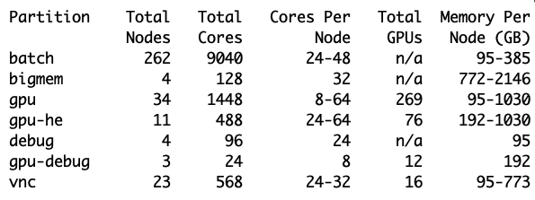
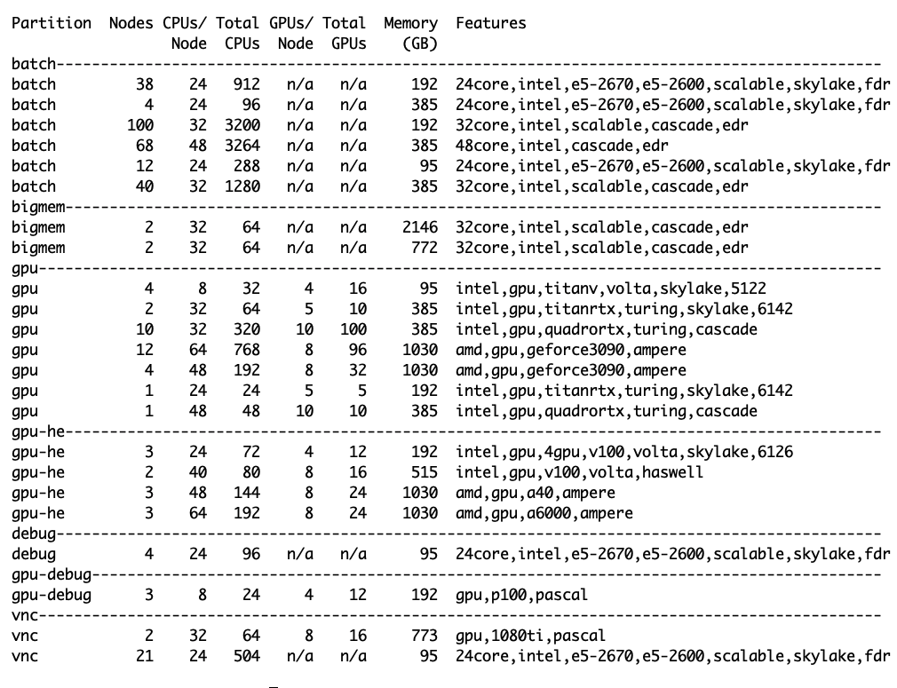

# System Hardware

## Oscar Specifications

|                        |       |
| ---------------------- | ----- |
| **Compute Nodes**      | 341   |
| **Total CPU Cores**    | 11792 |
| **GPU Nodes**          | 45    |
| **Total GPUs**         | 373   |
| **Large Memory Nodes** | 4     |

## Compute Nodes

Oscar has compute nodes in the partitions listed below.

* **batch** - The batch partition is for programs/jobs which need neither GPUs nor large memory.
* **bigmem** - The bigmem partition is for programs/jobs which require large memory.&#x20;
* **debug** - The debug partition is for users to debug programs/jobs.
* **gpu** - The gpu partition is for programs/jobs which require GPUs.
* **gpu-debug** - The gpu-debug partition is for users to debug gpu programs/jobs.&#x20;
* **gpu-he** -The gpu-he partition is for programs/jobs which need to access high-end GPUs.&#x20;
* **vnc** - The vnc partition is for users to run programs/jobs in an graphical desktop environment.&#x20;

Below are node details including cores and memory for all partitions.&#x20;

## Hardware details

Hardware details for all partitions. The Features column shows the features available for the --constraint option for slurm. This includes the available CPU types  as well GPUs&#x20;

